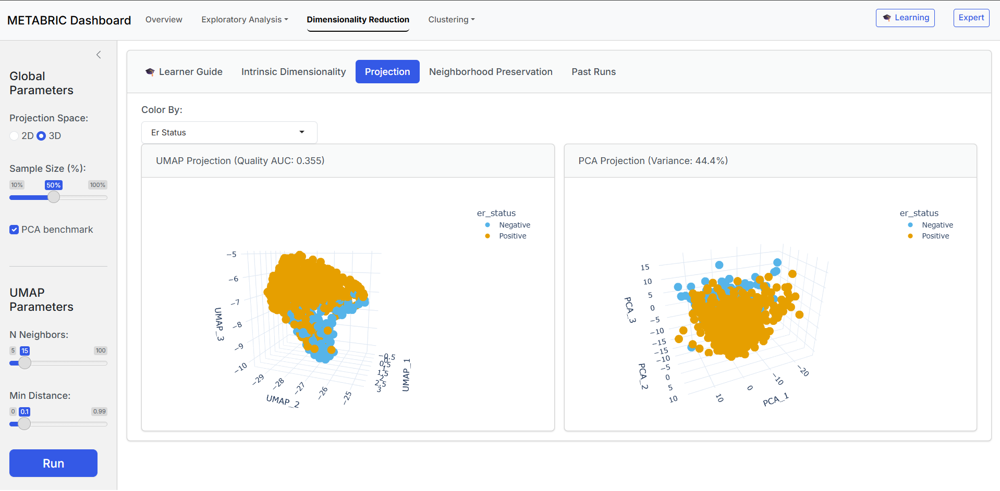
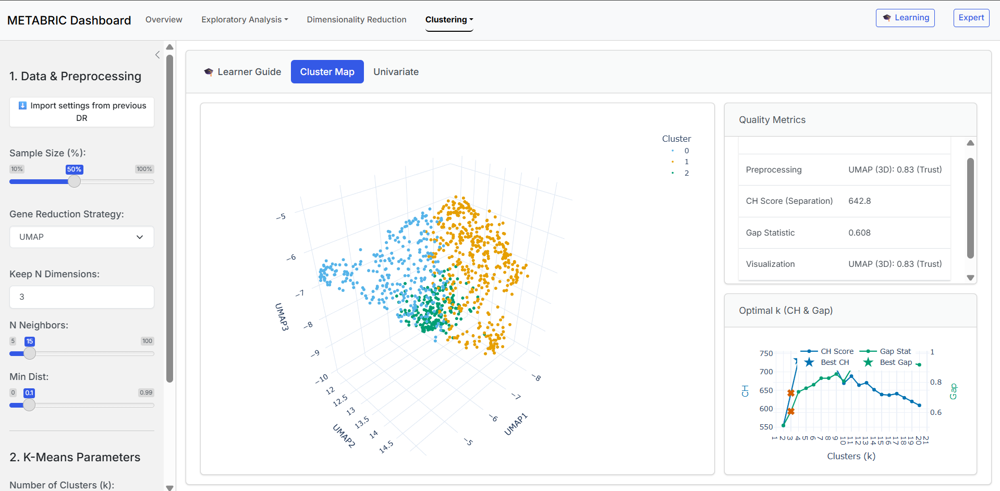

# METABRIC Dashboard

This repository contains an interactive visualization dashboard for exploring the [METABRIC](https://www.nature.com/articles/nature10983) breast cancer genomics dataset. The project was developped in the context of the course : [LDATA2010 - Information Visualization](https://uclouvain.be/cours-2024-LDATA2010) (UCLouvain, 2025-2026).

The dashboard enables exploration of 1,904 patient profiles through dimensionality reduction, clustering algorithms, and differential gene expression analysis with a dual-mode interface (Learning/Expert).

<div align="center">
  
  
</div>

The dashboard provides tools for genomic data exploration:

- **Exploratory Analysis**: Univariate and bivariate visualizations adapting to the data type
- **Dimensionality Reduction**: PCA and UMAP projections with quality metrics (trustworthiness, continuity, standardized quality, behaviour) and intrinsic dimensionality estimation (exponential correlation, Fisher analysis)
- **Clustering**: K-means, hierarchical, and DBSCAN algorithms with optimal cluster selection using Calinski-Harabasz and Gap statistic (among others)

## Installation

### 1. Download Dataset

Download the data from [Kaggle](https://www.kaggle.com/datasets/raghadalharbi/breast-cancer-gene-expression-profiles-metabric) and place it in the `data/` directory, using the **exact name** `METABRIC_RNA_Mutation.csv`:
```
dashboard_LDATA2010/
├── data/
│   └── METABRIC_RNA_Mutation.csv  # Place downloaded file here
├── app.py
├── requirements.txt
└── ...
```

### 2. Create Virtual Environment
```bash
# Navigate to project root
cd dashboard_LDATA2010

# Create virtual environment
python -m venv venv

# Activate (Windows)
venv\Scripts\activate

# Activate (Mac/Linux)
source venv/bin/activate
```

### 3. Install Dependencies
```bash
pip install -r requirements.txt
```
**Note** Dependencies installitation might take a few minutes.
## Usage

Launch the shiny application by typing in your terminal

```bash
shiny run app.py --reload
```

You can then open the dashboard by clicking on `http://localhost:8000`.

**Make sure that you don't have the `http://localhost:8000` already open !** Otherwise it won't work.

**Tip** Zoom/Unzoom on your browser to have an optimal balance depending on your computer.

### Interface Modes

- **Learning Mode** (🎓): Guided workflow with theoretical explanations
- **Expert Mode** (🔬): Full parameter control

Toggle modes via top-right navigation bar